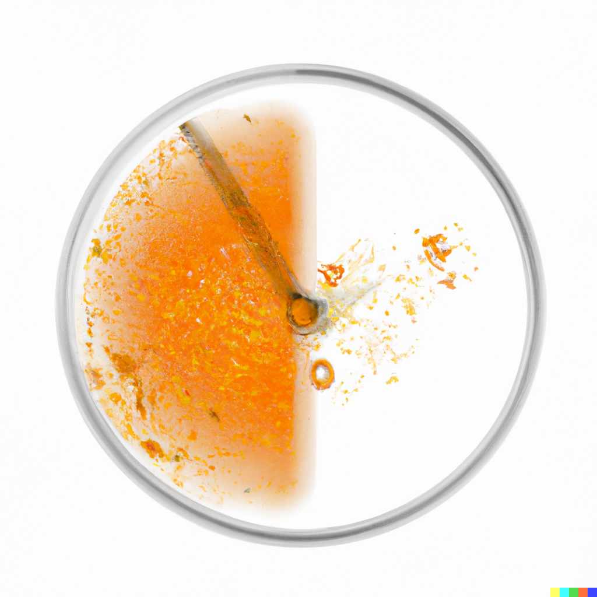

Chronidia
==============================
[//]: # (Badges)

Race tube image analysis and circadian period elucidation in Python.

### Copyright

Copyright (c) 2023, Alex Keeley

#### Acknowledgements
 
Project based on the 
[Computational Molecular Science Python Cookiecutter](https://github.com/molssi/cookiecutter-cms) version 1.1.
